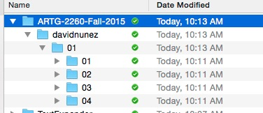

# ARTG 2260  PROGRAMMING BASICS
## Introduction, Getting Started, Drawing

[Homework](#homework)

### Homework

**Due September 16, 11:59PM**

------
####  Concepts to think about 

+ The P5 editor and programming environment
+ sketch.js & P5 Setup and Draw functions
+ The Canvas & Background
+ Coordinate System
+ Primitives (shapes, points, lines, text)
+ rectMode & ellipseMode
+ Variables
+ Comments & psuedo-code
<!-- + Loops (while & for)
 -->
+ Random Numbers
<!-- + Console
 -->
------

#### Homework Tasks

0. Before anything else, email me (david@davidnunez.com) with a brief description about yourself:

    - Your Name
    - Year & Field of Study
    - Experience in Programming (if any)
    - A couple sentences about what you are interested in vis a vis art & design, generally (doesn't have to be related to programming at all), and iff you have a portfolio or other way I can see your work, please include a link (I'm always impressed by what students are doing)!
    - A couple sentences about what you want to get out of this course.
    - How was the first class for you?  Too fast?  Too slow? Not what you were expecting? Help me make this semester useful for you.

1. Get setup with course infrastructure:

    - Read through syllabus.[https://github.com/davidnunez/ARTG-2260-Fall-2015](https://github.com/davidnunez/ARTG-2260-Fall-2015)
    - Download and install P5.JS editor: [http://p5js.org/download/](http://p5js.org/download/)
    - Sign up for the google group & say hello: [https://groups.google.com/forum/#!forum/artg-2260-fall-2015](https://groups.google.com/forum/#!forum/artg-2260-fall-2015)
    - Make sure you can access your Dropbox folder (I will set this up during or shortly after the first class).

2. Programming Explorations:

    - Remember: The point of these exercises is to help you practice programming; I'm looking for curiosity, exploration, and play.  I'm not expecting perfection.
    - Put your code in the appropriate sub-folders in your Dropbox folder:
        
    - At the top of each `sketch.js`, put a comment block like this:

                // -----------
                // ARTG 2260 - PROGRAMMING BASICS (Thursday)
                // Homework 01 - Exploration XX
                // YOUR NAME
                // DATE
                // -----------
    5. Write **brief** process documentation (don't go overboard... a short paragraph for each exploration is perfect) as a separate `README.txt` in each exploration folder.
        - At the top of the text file, include a text block like this:

                -----------
                ARTG 2260 - PROGRAMMING BASICS (Thursday)
                Homework 01 - Exploration XX
                YOUR NAME
                DATE
                -----------
        - Briefly describe the purpose of the code - what were you trying to do?
        - Explain in a broad sense, how the code works.
        - Describe any issues you had and how you tried to overcome them.
        - For pad and paper sketches, take a photo or scan and add them to the folder.
        - Include any links to code that is not your own. Give credit to the author. Describe how you used this code or how you changed this code.
    - Explorations:
    
        2. **Create a program that draws your self-portrait (or a portrait of a friend or pet or famous person).**
        3. **Create another program that iterates on the first program and plays with aesthetics & design just by making small changes.  (For example, by altering parameters in your drawing code, can you create variations on the style and representation of your image?   How does layering work (i.e. what happens when you draw things on top of each other, does the order of code matter)?)**
        4. **Bonus: Can you draw something that looks organic using only straight lines?**

3. Email me (david@davidnunez.com) when you are done with your explorations and they are in Dropbox.  I will consider the timestamp on that email as the "submitted time." **Even if you only submit a paragraph saying 'I have no idea what I'm doing,' that's much better than submitting nothing at all.**  In your email, write (at least) one question or topic related to the homework you'd like to hear more about in class. (ex. what was the trickiest part; was there anything especially frustrating; was your curiosity piqued about a particular subject we didn't cover in class)?

4. Be ready to discuss your code in class.
